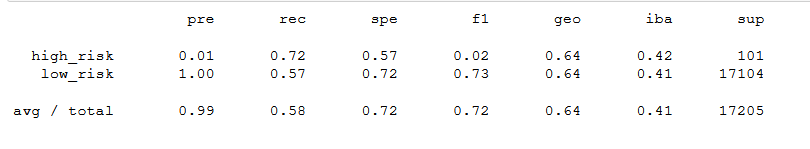
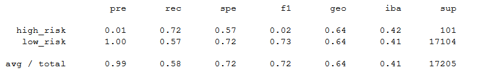
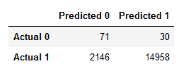
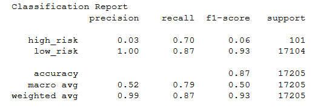

# Credit_Risk_Analysis

Overview of the analysis: Explain the purpose of this analysis.

The purpose of this analysis is well defined (4 pt)

Results: Using bulleted lists, describe the balanced accuracy scores and 
the precision and recall scores of all six machine learning models. Use 
screenshots of your outputs to support your results.
There is a bulleted list that describes the balanced 
accuracy score and the precision and recall scores of
 all six machine learning models (15 pt)

Summary: Summarize the results of the machine learning models, and include 
a recommendation on the model to use, if any. If you do not recommend any 
of the models, justify your reasoning.
There is a summary of the results (2 pt)
There is a recommendation on which model to use, or there 
is no recommendation with a justification (3 pt)

Thanks to Jill I am usings a credid card dataset from LendingClub to oversample the data using
RandomOverSampler and SMOTE algorithms. I'll also undersample the data with the ClusterCentroids 
algorithm. With these methods I use the SMOTEENN algorithm to combine both the over- and undersampling 
approaches. With the BalancedRandomForestClassifier and the EasyEnsembleClassifier machine learning 
models I'll reduce bias and predict credit risk. 

For all three algorithms, the following have been completed:
An accuracy score for the model is calculated (7.5 pt)
A confusion matrix has been generated (7.5 pt)
An imbalanced classification report has been generated (15 pt)
![https://github.com/Mattiejordan/Credit_Risk_Analysis/blob/main/credit_risk_resampling.ipynb]
Deliverable 1: Use Resampling Models to Predict Credit Risk

The combinatorial SMOTEENN algorithm does the following:
An accuracy score for the model is calculated (5 pt)
A confusion matrix has been generated (5 pt)
An imbalanced classification report has been generated (5 pt)
![https://github.com/Mattiejordan/Credit_Risk_Analysis/blob/main/credit_risk_ensemble.ipynb]
Deliverable 2: Use the SMOTEENN Algorithm to Predict Credit Risk

The BalancedRandomForestClassifier algorithm does the following:
An accuracy score for the model is calculated (2.5 pt)
A confusion matrix has been generated (2.5 pt)
An imbalanced classification report has been generated (5 pt)
The features are sorted in descending order by feature importance (5 pt)

Deliverable 3: Use Ensemble Classifiers to Predict Credit Risk

Balanced Random Forest Classifier

The EasyEnsembleClassifier algorithm does the following:
An accuracy score of the model is calculated (2.5 pt)
A confusion matrix has been generated (2.5 pt)
An imbalanced classification report has been generated (5 pt)

Easy Ensemble AdaBoost Classifier
