# Credit_Risk_Analysis

Thanks to Jill I am using a credit card dataset from LendingClub to oversample the data using
RandomOverSampler and SMOTE algorithms. I'll also undersample the data with the ClusterCentroids 
algorithm. With these methods I use the SMOTEENN algorithm to combine both the over- and undersampling 
approaches. With the BalancedRandomForestClassifier and the EasyEnsembleClassifier machine learning 
models I'll reduce bias and predict credit risk. To help me clarify the output of these algorithms 
I've used this source for information on Precision, Recall and F1 Scores. 
[Source](https://towardsdatascience.com/accuracy-precision-recall-or-f1-331fb37c5cb9)
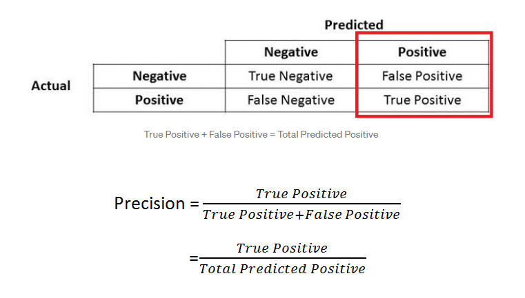
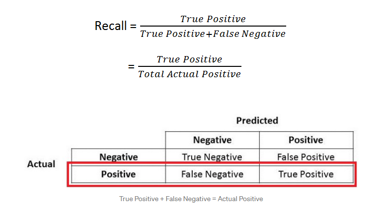
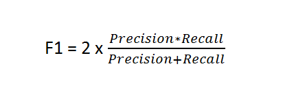 
Images from [Source](https://towardsdatascience.com/accuracy-precision-recall-or-f1-331fb37c5cb9)

For the next three algorithms, the following have been completed:
[Credit_Risk_Resampling](https://github.com/Mattiejordan/Credit_Risk_Analysis/blob/main/credit_risk_resampling.ipynb)

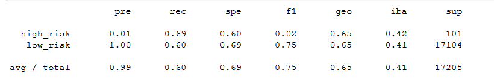
* Naive OverSampling has an accuracy of 0.64807
__________________________________________________________________________________
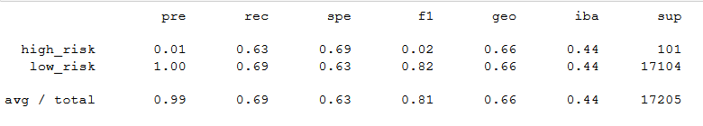
* Smote OverSampling has an accuracy of 0.66257
__________________________________________________________________________________
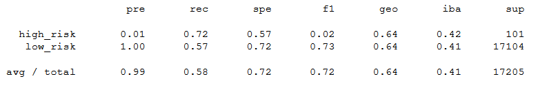
* UnderSampling using ClusterCentroids has an accuracy of 0.64862
__________________________________________________________________________________
The combinatorial SMOTEENN algorithm does the following:
[Credit_Risk_Ensemble](https://github.com/Mattiejordan/Credit_Risk_Analysis/blob/main/credit_risk_ensemble.ipynb)

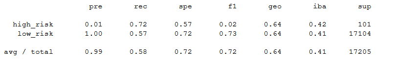
* Smote Over- and UnderSampling using SMOTEENN has an accuracy of 0.64862
__________________________________________________________________________________
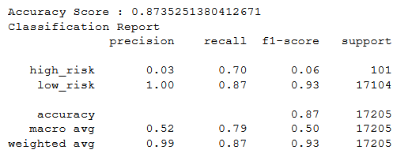
* ### Balanced Random Forest Classifier has an accuracy of 0.87352
__________________________________________________________________________________
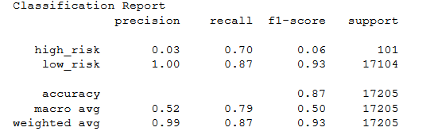
* ### Easy Ensemble AdaBoost Classifier has an accuracy of 0.87352
__________________________________________________________________________________

Summary:

I have found using the machine learning models BalancedRandomForestClassifier and the EasyEnsembleClassifier
that I reduce bias and both are highly rated for use in analyzing credit data. Across the board their precision, 
recall, and ultimately highest F1 Scores are the best percentages compared to the previous models. They have 
both have the highest F1-Scores of 0.93. 

________________________________________________
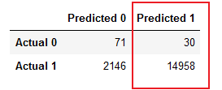
Precision
________________________________________________
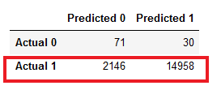
Recall
_______________________________________________